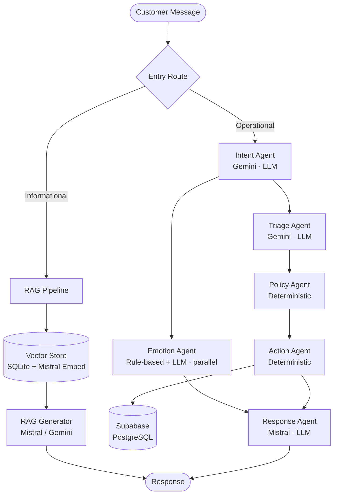
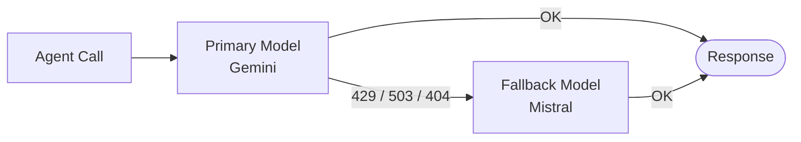

<div align="center">

# Zeni — BFSI Chatbot Backend

**AI-orchestrated customer support for Banking, Financial Services, and Insurance**


[Overview](#overview) · [Pipeline](#agent-pipeline) · [API](#api-reference) · [Setup](#getting-started) · [Testing](#testing)

</div>

---

## Overview

Zeni is the backend for a multi-agent BFSI chatbot that triages customer concerns, creates structured support tickets, and generates empathetic, tone-calibrated responses — without human intervention on routine cases.

Each message is routed through a sequential agent pipeline. Informational queries are deflected to the RAG subsystem; operational concerns flow through triage, policy, and action agents before a response is generated.

---

## Agent Pipeline



### Agents

| Agent | Type | Role |
|---|---|---|
| **Intent Agent** | LLM | Classifies into 15+ intent types across informational, operational, and out-of-scope groups |
| **Emotion Agent** | Hybrid (rule + LLM) | Detects emotion label (`angry` `frustrated` `anxious` `distressed` `neutral`) and intensity — runs in parallel |
| **Triage Agent** | LLM | Extracts fraud/urgency signals, computes P1–P3 priority via importance × urgency matrix |
| **Policy Agent** | Deterministic | Maps priority to resolution path — P1 → live escalation, P2 → urgent ticket, P3 → standard |
| **Action Agent** | Deterministic | Executes Supabase writes — cases, tickets, case_actions, card-block confirmation flows |
| **Response Agent** | LLM | Generates tone-calibrated reply using full pipeline context |

### Priority Matrix

| Priority | Trigger | Resolution |
|---|---|---|
| **P1 — Critical** | Active fraud, lost/stolen card | Live escalation |
| **P2 — Urgent** | Account access/restriction issues | Urgent ticket |
| **P3 — Standard** | Transfers, refunds, billing disputes | Standard ticket |
| **Informational** | Product, fee, policy, branch queries | RAG response — no ticket created |

### Model Routing

Every LLM call goes through a primary/fallback router. On retryable errors (429, 503, 404) the router automatically switches providers with no manual intervention.



---

## Tech Stack

| Layer | Technology |
|---|---|
| Runtime | Node.js 20 + TypeScript |
| Framework | Express 4 |
| Database | Supabase (PostgreSQL) |
| LLM Providers | Gemini (Google AI Studio), Mistral AI |
| RAG | Mistral Embed + SQLite vector store |
| Auth | Supabase Bearer token |
| Rate Limiting | express-rate-limit — per-user + per-IP |
| Testing | Vitest |

---

## API Reference

All protected routes require `Authorization: Bearer <supabase_token>`.

### Chat

| Method | Endpoint | Description |
|---|---|---|
| `POST` | `/api/chat/session` | Get or create active chat session |
| `POST` | `/api/chat/message` | Send a message — runs full agent pipeline |
| `GET` | `/api/chat/messages` | Retrieve message history for active session |
| `GET` | `/api/chat/tickets` | Fetch ticket details by case IDs |

### Agent Dashboard

| Method | Endpoint | Description |
|---|---|---|
| `GET` | `/api/agent/tickets` | All open/in-progress tickets with customer data |
| `GET` | `/api/agent/analytics/operations` | Ticket volume, priority breakdown, daily trend |
| `GET` | `/api/agent/analytics/emotions` | Emotion distribution, trend, and high-intensity summary |
| `GET` | `/api/agent/tickets/:ticketId/conversation` | Full conversation history for a ticket |

### System

| Method | Endpoint | Auth | Description |
|---|---|---|---|
| `GET` | `/health` | None | Health check |
| `GET` | `/api/me` | Required | Authenticated user identity |
| `POST` | `/api/dev/create-demo-case` | Required | Seed demo data (dev only) |

### Rate Limits

| Scope | Limit | Keyed By |
|---|---|---|
| Global | 120 req/min | IP |
| `POST /api/chat/message` | 10 req/min | User ID → IP fallback |
| `POST /api/chat/session` | 15 req/min | User ID → IP fallback |
| `GET /api/agent/*` | 60 req/min | User ID → IP fallback |
| `POST /api/dev/*` | 5 req/min | IP |

---

## Getting Started

### Prerequisites

- Node.js 20+
- A Supabase project with the required schema
- At least one LLM API key (Mistral or Google AI Studio)

### Installation

```bash
git clone <repo-url>
cd banking-chatbot-backend
npm install
```

### Environment

```bash
cp .env.example .env
# Fill in your values
```

| Variable | Required | Description |
|---|---|---|
| `SUPABASE_URL` | Yes | Your Supabase project URL |
| `SUPABASE_ANON_KEY` | Yes | Supabase anon key |
| `SUPABASE_SERVICE_ROLE_KEY` | Yes | Supabase service role key |
| `MISTRAL_API_KEY` | Recommended | Mistral AI API key |
| `GOOGLE_AI_STUDIO_API_KEY` | Recommended | Google AI Studio key |
| `PRIMARY_INTENT_MODEL` | No | Default: `gemini-2.5-flash-lite` |
| `FALLBACK_INTENT_MODEL` | No | Default: `mistral-small-2603` |
| `PRIMARY_TRIAGE_MODEL` | No | Default: `gemini-2.5-flash-lite` |
| `FALLBACK_TRIAGE_MODEL` | No | Default: `mistral-small-2603` |
| `PRIMARY_RESPONSE_MODEL` | No | Default: `mistral-small-2603` |
| `FALLBACK_RESPONSE_MODEL` | No | Default: `gemini-2.5-flash-lite` |
| `KB_DOCS_PATH` | No | Default: `docs/kb` |
| `VECTOR_STORE_PATH` | No | Default: `data/vector-store.db` |
| `RAG_TOP_K` | No | Default: `4` |
| `RAG_SIMILARITY_THRESHOLD` | No | Default: `0.55` |

### Running

```bash
# Development — hot reload
npm run dev

# Production build
npm run build && npm start

# Run test suite
npm test

# Ingest knowledge base documents into vector store
npm run ingest-kb

# Run SLA evaluation job
npm run sla-job
```

---

## Project Structure

```
src/
├── agents/           # Intent, Emotion, Triage, Policy, Action, Response agents
├── config/           # Supabase client, env loader
├── contracts/        # TypeScript interfaces for agent I/O
├── jobs/             # SLA evaluator and business-day utilities
├── llm/              # Gemini + Mistral clients, model router, prompts
├── middleware/        # Auth (Supabase), rate limiting
├── orchestrator/     # Entry route, conversation manager
├── rag/              # Embeddings, vector store, retrieval, generator
├── routes/           # Express route handlers
├── services/         # Customer, session, case, ticket, message services
├── types/            # Shared TypeScript types
└── utils/            # JSON extraction, emotion lexicon, normalizers
```

---

## Testing

The integration test suite covers 70 scenarios across 11 groups — informational queries, P1–P3 operational flows, card-block multi-turn interactions, multi-issue detection, security/prompt-injection refusals, and edge cases.

```bash
npm test
```

**Final result: 66/70 passing (94.3%)** — the 4 failures were LLM non-determinism in edge cases and one API rate-limit timeout during test execution.

| Test Group | Scenarios | Coverage |
|---|---|---|
| Informational (RAG) | 15 | Product, fee, policy, branch — no ticket created |
| P3 Operational | 10 | Standard ticket creation, correct priority |
| P1 Critical | 8 | Fraud/card-loss detection, live escalation |
| Card Block Flows | 6 | Multi-turn YES/NO confirmation |
| Multi-Issue | 4 | Two+ distinct concerns, multiple tickets |
| Hybrid (Info + Operational) | 3 | Combined RAG + ticket |
| Security / Malicious Input | 3 | Prompt injection, data exfiltration — all refused |
| Edge Cases | 12 | Topic switch, broken English, follow-up |

---

<div align="center">

Private — Polytechnic University of the Philippines, 2026

</div>
